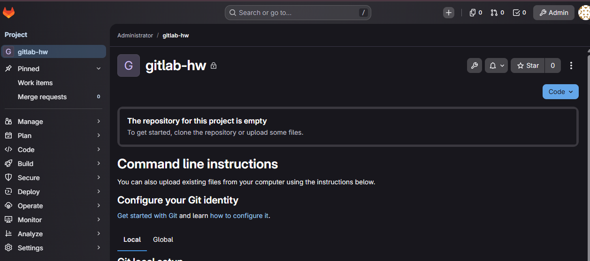
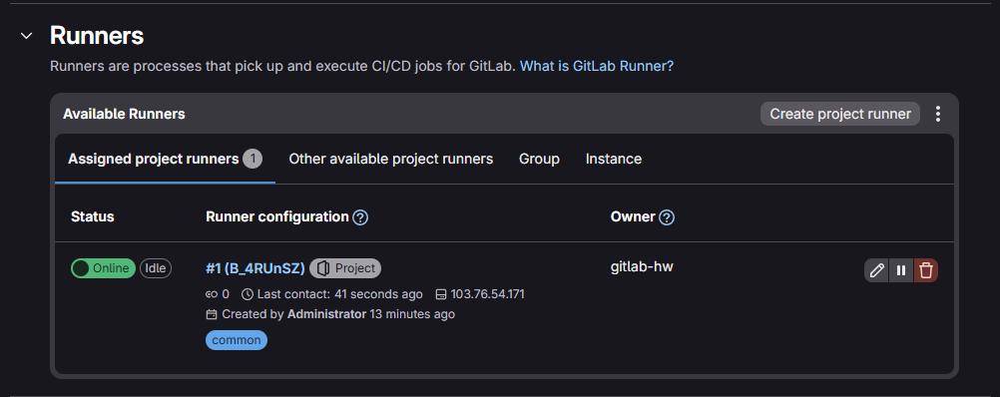

# 8-03 "GitLab" - Мурашов Денис

## Задание 1: Развертывание GitLab
1. развернут GitLab.
2. Создан проект `gitlab-hw`.
3. Зарегистрирован Runner.




## Задание 2
1. Origin изменен на локальный репозиторий GitLab.
2. Подготовлены тестовые файлы на Go и Dockerfile.
3. Настроен и успешно выполнен `.gitlab-ci.yml`.

**Код пайплайна:**
```yaml
stages:
  - test
  - build

test:
  stage: test
  image: golang:1.17
  script: 
   - go test .

build:
  stage: build
  image: docker:latest
  script:
   - docker build .

